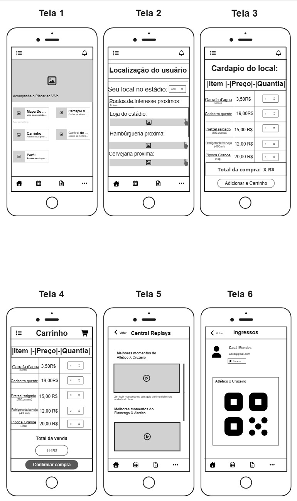

# ⚽ CopaNaMão - Protótipo de Baixa Fidelidade

## 👥 Integrantes

- Cauã Mendes  
- Fábio Henrique Zanini Ferreira  
- Gabriel Ferreira de Souza  
- Lucas Henrique Miranda  

**Curso:** Análise e Desenvolvimento de Sistemas (ADS)  
**Instituição:** Centro Universitário UNA – Belo Horizonte  

---

## 💡 Problema Focado

O projeto foi desenvolvido para resolver as principais dores dos torcedores dentro de um estádio:

- Filas longas para compra de alimentos  
- Dificuldade de localização dentro da arena  
- Perda de lances importantes durante deslocamentos  

Nosso foco principal foi **reduzir o tempo fora do assento**, permitindo que o usuário resolva tudo pelo celular de forma rápida e intuitiva.

---

## 🎯 Proposta de Solução

Criamos o aplicativo **CopaNaMão**, que centraliza:

- Pedido de alimentos direto pelo celular  
- Localização dentro do estádio  
- Acesso rápido a replays  
- Visualização de ingressos  

Tudo com foco em **uso rápido, direto e sob pressão** (ambiente barulhento e com distrações).

---

## 🧠 Justificativa de Design

O design do protótipo foi pensado com base em princípios de IHC e usabilidade em ambientes extremos:

### 🔹 Simplicidade
- Interface limpa (low fidelity)
- Uso de blocos grandes e bem definidos

### 🔹 Hierarquia Visual
- Informações principais sempre no topo
- Separação clara entre funções

### 🔹 Acesso Rápido
- Botões grandes e fáceis de clicar
- Navegação simples com poucos passos

### 🔹 Escaneabilidade
- Conteúdo fácil de “bater o olho”
- Estrutura organizada por seções

---

## 📱 Descrição das Telas

### 🏠 Tela 1 – Home / Dashboard
- Placar ao vivo  
- Acesso rápido para:
  - Mapa do estádio  
  - Cardápio  
  - Carrinho  
  - Central de replays  
  - Perfil  

---

### 📍 Tela 2 – Mapa do Estádio
- Localização do usuário (setor/assento)  
- Pontos de interesse próximos:
  - Loja  
  - Hamburgueria  
  - Cervejaria  

---

### 🍔 Tela 3 – Cardápio
- Lista de itens disponíveis  
- Preços visíveis  
- Seleção de quantidade  
- Botão para adicionar ao carrinho  

---

### 🛒 Tela 4 – Carrinho
- Resumo do pedido  
- Ajuste de quantidades  
- Valor total  
- Botão de confirmação de compra  

---

### 🎥 Tela 5 – Central de Replays
- Lista de lances recentes  
- Vídeos organizados por jogo  
- Acesso rápido aos melhores momentos  

---

### 🎟️ Tela 6 – Ingressos / Perfil
- Identificação do usuário  
- QR Code do ingresso  
- Informações do jogo  

---

## 🔄 Fluxo do Usuário

### 🛒 Pedir um lanche:

1. Acessa a **Home**
2. Clica em **Cardápio**
3. Seleciona itens e quantidades  
4. Adiciona ao **Carrinho**
5. Confirma a compra  

---

### 🎥 Assistir um replay:

1. Acessa a **Home**
2. Clica em **Central de Replays**
3. Escolhe o lance desejado  
4. Assiste o vídeo

---

## 🧠 Reflexão de IHC

Em um ambiente com muito barulho e distrações, o layout foi pensado para reduzir a carga cognitiva do usuário.

Para isso, utilizamos:
- Interface simples e sem excesso de informação  
- Hierarquia visual clara (informações principais no topo)  
- Botões grandes e fáceis de identificar  
- Navegação consistente entre telas  
- Fluxos curtos, com poucos passos  

Assim, mesmo durante momentos de distração, o usuário consegue entender rapidamente a interface e retomar o uso sem se perder.

---

## 📸 Protótipo

